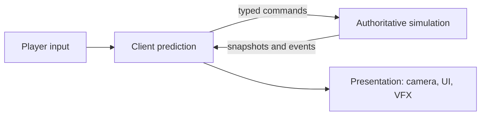

# Arena Architecture


<p align="center">
  <strong>Server-authoritative multiplayer architecture for Unity</strong><br />
  Original design specifications and typed C# contracts for building a third-person shooter.
</p>


## Why this exists

Most shooter tutorials trust the client too much. This project documents a clean split:

- **Clients** sample input, predict, and present camera, UI, and VFX.
- **The authority** (dedicated server or host) owns movement, ammo, hits, damage, and match state.
- **The wire** carries typed commands, snapshots, and events instead of string messages or shared mutable globals.


<p align="center">
  <a href="LICENSE"></a>
  
  
  
</p>

> **Status:** Design phase. Documentation is stable; code contains contracts and stubs only.

## What this repository is

- An original, server-authoritative design for a multiplayer shooter.
- A reference for clearly separating client prediction from authoritative simulation.
- A foundation of typed C# contracts for commands, snapshots, events, and platform boundaries.

## What this repository is not

- A finished game, Unity project template, or networking implementation.
- A source-compatible recreation of an existing commercial game.
- A repository of proprietary assets, tuning values, protocol details, or decompiled code.

## Start here

1. Read the [architecture overview](docs/00-overview.md) to understand system ownership.
2. Review [the C# contracts](Assets/Scripts/Core/Contracts.cs) to see the message boundaries.
3. Follow the [roadmap](docs/10-roadmap.md) to build an original offline vertical slice first.
4. Add transport and reconciliation only after the authority model is established.

## Documentation

| # | Doc | Covers |
|---|-----|--------|
| 00 | [Overview](docs/00-overview.md) | Principles, ownership matrix, combat data flow |
| 01 | [Movement](docs/01-movement.md) | Motor, states, prediction and reconciliation |
| 02 | [Aiming & aim assist](docs/02-aiming.md) | Target pipeline, scoring, bounded correction |
| 03 | [Weapons & ammo](docs/03-weapons.md) | Fire pipeline, reload, recoil, spread |
| 04 | [Hitboxes](docs/04-hitboxes.md) | Hit regions, history rewind |
| 05 | [Damage & elimination](docs/05-damage.md) | Resolution order, lifecycle, kill attribution |
| 06 | [Combat state & animation](docs/06-combat-state.md) | Action state vs locomotion state |
| 07 | [Networking](docs/07-networking.md) | Commands, snapshots, events, anti-desync |
| 08 | [World systems](docs/08-world-systems.md) | Match, zone, spawning, inventory, vehicles, audio, persistence |
| 09 | [Platform integration](docs/09-platform.md) | Typed Android adapter, launch context, permissions |
| 10 | [Roadmap](docs/10-roadmap.md) | Milestones |

## Repo layout

```
Assets/Scripts/Core/   Typed contracts (commands, snapshots, events)
docs/                  Architecture documents
.github/               Issue templates
```

## Getting started

1. Create a Unity project (2022 LTS or newer) and copy `Assets/Scripts/Core` in.
2. Read `docs/00-overview.md`, then follow `docs/10-roadmap.md` milestone 1 (offline vertical slice).
3. Keep all tuning in your own ScriptableObjects, authored from scratch.

## Design rules

- Original content only: maps, weapons, UI, audio and numbers are yours.
- Aim assist is a local input-feel layer; the authority always re-validates shots.
- Voice chat is optional, off by default, and needs consent and moderation before shipping.

## Contributing and governance

See [CONTRIBUTING.md](CONTRIBUTING.md) for contribution guidance, [CODE_OF_CONDUCT.md](CODE_OF_CONDUCT.md) for community expectations, and [SECURITY.md](SECURITY.md) for private vulnerability reporting. License: [MIT](LICENSE).
