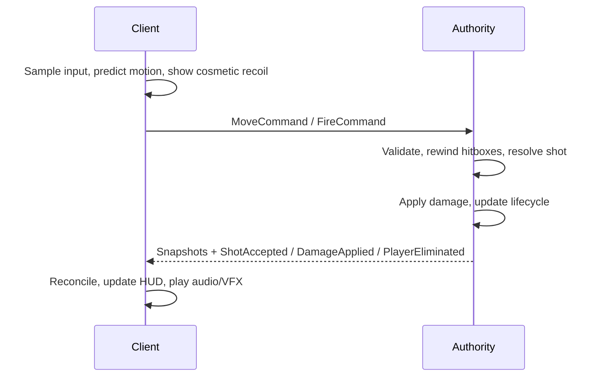

# 00 · Overview

## Principles

1. **Authority owns truth.** Movement, ammo, hit results, damage, elimination and match phase are decided on the authority.
2. **Clients send intent, never outcomes.** No client message carries a damage value or a chosen hit target.
3. **Typed messages.** Commands, snapshots and events are structs, not strings or global dictionaries.
4. **Simulation is separate from presentation.** Animation, camera, UI and audio consume state; they never grant ammo, damage or readiness.
5. **Original content.** All tuning lives in ScriptableObjects authored from scratch.

## Ownership matrix

| System | Client-owned | Authority-owned | Commands | Snapshots / events | Prediction |
|---|---|---|---|---|---|
| Movement | Input sampling, local yaw | Simulation, collision, final transform | `MoveCommand` | Transform/velocity/state snapshot | Replay unacknowledged commands |
| Aim | Camera, target highlight | Legal shot-direction validation | Aim inside `FireCommand` | Shot outcome | Correct crosshair/hit marker |
| Weapon | Trigger/reload intent, cosmetic recoil | Ammo, cadence, reload completion | Fire/reload/equip | Weapon state, shot events | Predict effects, correct ammo |
| Hit detection | Optional local trace | Historical hitbox query | none beyond fire | Hit/miss event | Correct predicted impact |
| Damage | UI prediction only | Health, mitigation, elimination | none | Damage/health/lifecycle events | Correct health and feedback |
| Hitboxes | Visual interpolation | Simulation pose and history | none | Entity transforms | Interpolate remote visuals |
| Combat state | Requested actions | Valid transitions | Aim/fire/reload/switch | Combat snapshot | Restore authoritative state |

## End-to-end combat flow

